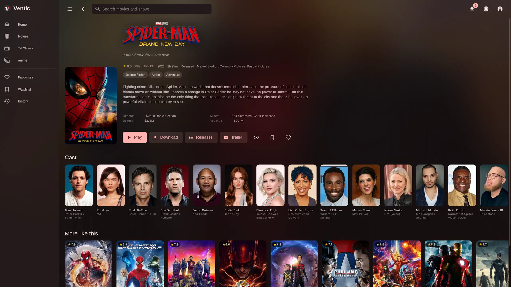
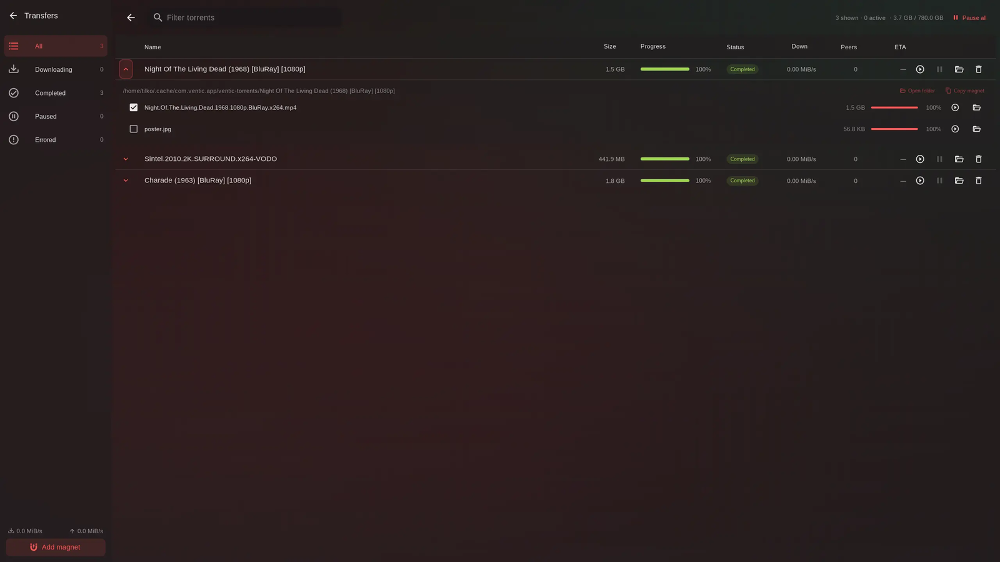
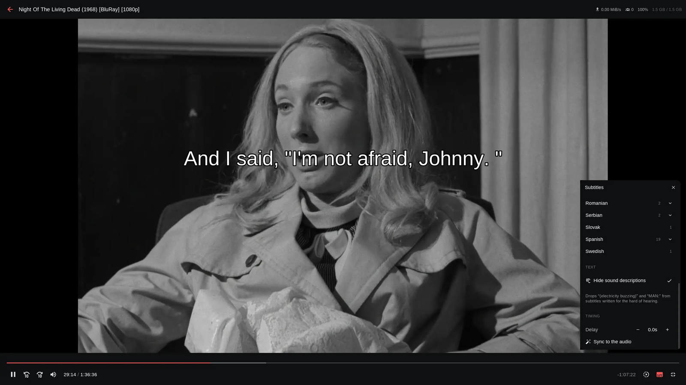
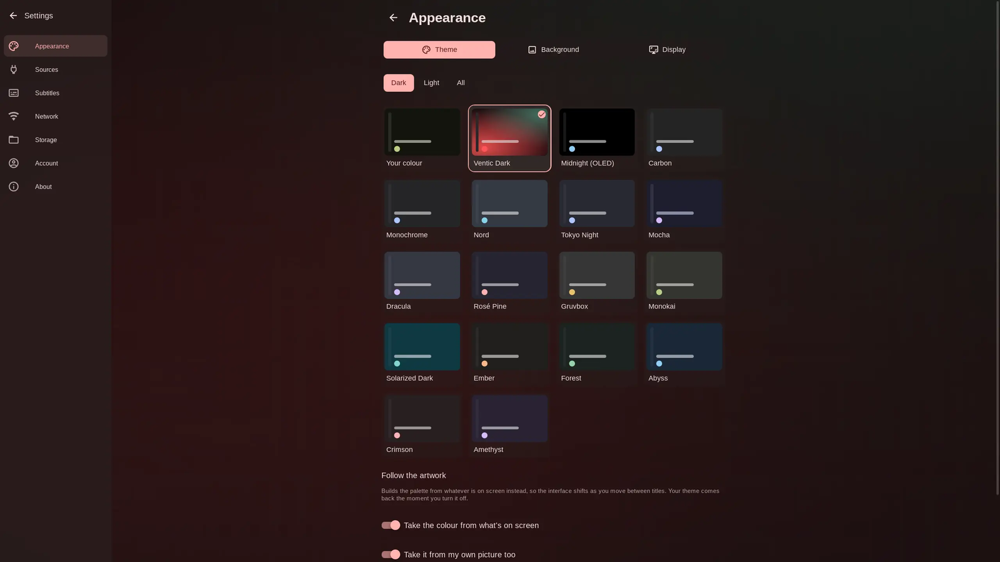
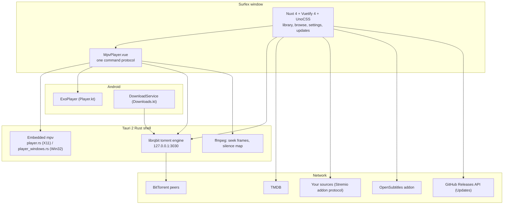

<div align="center">
<a name="readme-top"></a>


# Surfex

<h3>A modern Movies and Series media library and player for Desktop and Android TV</h3>

Keeps track of what you're watching, and plays movies and series in a real mpv window rather than a
browser `<video>` tag — so half-downloaded MKVs, HEVC, AV1 and DTS all just play. Built with
Nuxt 4 and Tauri 2, driven as happily by a TV remote as by a mouse.

<br/>

[![Version][badge-version]][releases] &nbsp;
[![License][badge-license]][license] &nbsp;
[![Tauri][badge-tauri]][tauri] &nbsp;
[![Nuxt][badge-nuxt]][nuxt] &nbsp;
[![Engine][badge-engine]][librqbit] &nbsp;
[![Platforms][badge-platforms]][releases]

<br/>

[Why Surfex](#why-surfex) &middot; [Features](#feature-tour) &middot; [Sources](#sources) &middot;
[In-App Updates](#in-app-updater) &middot; [Install](#install) &middot; [Build](#build-from-source) &middot; [Architecture](#architecture) &middot;
[FAQ](#faq) &middot; [Contributing](#contributing)

</div>

<br/>

> [!IMPORTANT]
> **Surfex hosts no content and indexes no content.** It ships with **no sources**, searches
> nothing on its own, and will not suggest anywhere to look. A source is a URL *you* add — see
> [Sources](#sources). With none configured, Surfex is a general-purpose torrent client with a
> very good player attached.

<br/>

<details>
<summary><kbd>Table of contents</kbd></summary>

<br/>

- [Why Surfex](#why-surfex)
- [Feature Tour](#feature-tour)
  - [Rooms and views](#rooms-and-views)
  - [The player](#the-player)
  - [Playback and codecs](#playback-and-codecs)
  - [Downloads](#downloads)
  - [Subtitles](#subtitles)
  - [Themes and appearance](#themes-and-appearance)
  - [Built for a remote](#built-for-a-remote)
  - [Live TV](#live-tv)
- [Screenshots](#screenshots)
- [In-App Updater](#in-app-updater)
- [Sources](#sources)
  - [Adding a source by link](#adding-a-source-by-link)
- [Your library](#your-library)
- [Privacy](#privacy)
- [Install](#install)
  - [Opening it on macOS](#opening-it-on-macos)
- [Configuration](#configuration)
  - [Languages](#languages)
- [Build from source](#build-from-source)
- [Architecture](#architecture)
- [Tests](#tests)
- [FAQ](#faq)
- [Contributing](#contributing)
- [Legal](#legal)
- [Acknowledgements](#acknowledgements)
- [License](#license)

</details>

<br/>

## Why Surfex

Most torrent-backed players are a browser `<video>` tag in a trench coat, and the codec support
shows. Surfex embeds the real thing and keeps the library around it honest and local.

- **A real mpv window, not a video tag.** On Linux and Windows the Rust side parents an actual
  mpv window into the page and keeps it glued to a box in the layout. mpv carries its own
  ffmpeg, so HEVC, AV1, 10-bit, E-AC-3, DTS and half-downloaded MKVs play with no codec packs.
- **The engine is in the app.** [librqbit][librqbit] runs in-process — a full downloads UI with
  file pickers, seeding, speed limits and a disk budget, not a hidden cache.
- **Streaming while it downloads.** Playback starts on the first bytes; already-downloaded
  titles replay with no TMDB lookup, no source search and no peers.
- **One player, three backends.** Where mpv can't be embedded, ExoPlayer (Android) or the
  webview's `<video>` answers the *same* command protocol, so there is one player component and
  one set of controls rather than three.
- **Dedicated In-App Updates System.** Built-in update manager with animated live progress tracking,
  platform-aware routing (Android APK auto-install, Windows, macOS, Linux).
- **Your library stays yours.** History, progress, favourites and the watchlist live in this
  device's storage. No Surfex account, no Surfex server, no sync — one file carries the lot.
- **Usable from the sofa.** Full d-pad navigation, focus-first styling and an Android TV build —
  a remote reaches everything a mouse does.
- **No sources, ever.** The empty source list is a deliberate feature, not an oversight.
  Surfex never suggests where to look — a user typing in a URL they found themselves
  is the entire onboarding flow.
- **General-purpose torrent client, even empty.** With no source configured there is
  nothing to search, but the engine, the magnet paste box and the full downloads UI
  keep working — start a magnet or open a `.torrent` file and watch it fetch,
  with file pickers, seeding and limits, no source required.

<p align="right"><a href="#readme-top">&#9650; back to top</a></p>

## Feature Tour

<table>
<tr>
<td width="33%" valign="top">

**Browse and track**

Home, Movies, TV, Anime, Search, plus Favourites, Watchlist and History. TMDB metadata
throughout — posters, backdrops, cast, ratings, per-episode watched state and resume points.

</td>
<td width="33%" valign="top">

**Play anything**

Embedded mpv on the desktop, ExoPlayer on Android, `<video>` everywhere else. Subtitle search
with audio auto-sync, seek-preview thumbnails, audio and subtitle track menus, speed control
— plus per-title volume levelling, a centre-channel dialogue boost for 5.1 mixes, and resume
points on every episode.

</td>
<td width="33%" valign="top">

**Own the pipes**

An in-process BitTorrent engine with a real downloads page: magnets, `.torrent` files, file
selection, seeding, speed limits, a disk budget that evicts oldest-watched first, and a
Wi-Fi-only switch.

</td>
</tr>
</table>

<br/>

### Rooms and views

| Room | What you get |
| --- | --- |
| **Home** | Continue watching, Trending today, Popular movies and shows, Top rated, In cinemas |
| **Movies** / **TV** / **Anime** | Browse rows with grid or list layout, remembered per session |
| **Search** | One box across TMDB; results carry straight through to a source search |
| **Favourites** / **Watchlist** / **History** | The three local lists |
| **Detail** | Backdrop, synopsis, cast, trailer, seasons and episodes with per-episode state |
| **Downloads** | The engine's UI — add, pick files, pause, seed, limit, evict |
| **Watch page** | The player with tracks, audio, subtitle, cast and update-aware controls |
| **TV room** | A remote-first layout of the same library for Android TV |
| **Settings** | Appearance, Language, Sources, Subtitles, Audio, Network, Storage, Account, Updates, Support, About |

<p align="right"><a href="#readme-top">&#9650; back to top</a></p>

### The player

One component, one set of controls, three backends underneath.

| Capability | Detail |
| --- | --- |
| **Backends** | Embedded mpv (Linux, Windows, macOS), ExoPlayer (Android), webview `<video>` (browser) — all answering the same command/property protocol |
| **Start early** | Playback begins on the first bytes; the engine is polled for a real byte before mpv launches, so a fresh torrent never opens a black box. Titles already downloaded replay with no TMDB lookup, no source search and no peers |
| **Seek preview** | Frames pulled with ffmpeg and cached, warmed only while the control bar is up — the one place the app reaches for ffmpeg while watching |
| **Seek preview** | Frames pulled with ffmpeg and cached, warmed only while the control bar is up |
| **Tracks** | The file's own audio and subtitle tracks, the release's subtitle files, and OpenSubtitles — in one menu |
| **Subtitle styling** | Font, size, colour, outline, position, applied to mpv and to the page-drawn cues alike, previewing live from Settings |
| **Volume levelling** | Quiet dialogue up, loud scenes down, in four steps — plus a dialogue boost that raises the centre channel of a 5.1 mix and nothing else. Set a default under Settings, or change the film you're watching from the player's Audio panel, which remembers that title alone |
| **Auto-sync** | A file cut for another release is slid onto the audio's silence map (desktop only — it needs ffmpeg, which Windows bundles) |
| **Resume** | Progress recorded as it plays, per episode, and picked back up from the card or the detail page |
| **Casting** | Hand the film to another Surfex on the same network — it streams from the device that already has it, resuming where you were, so nothing is downloaded twice. Devices are found by sweeping the subnet; acting on a cast needs the pairing code the receiving device shows. LAN only, off until switched on under Settings → Network, and no account or server anywhere in it |
| **Fullscreen** | Held for as long as the player is mounted; Android goes landscape and immersive |

<p align="right"><a href="#readme-top">&#9650; back to top</a></p>

### Playback and codecs

| Platform | Backend | Notes |
| --- | --- | --- |
| Linux | mpv | Needs `mpv` and `ffmpeg` on PATH |
| Windows | mpv | Ships its own `mpv.exe` and `ffmpeg.exe` — nothing to install |
| Android phone / TV | ExoPlayer | The device's own decoders; landscape and immersive while playing |
| macOS | mpv | Ships its own libmpv, linked rather than launched |
| Browser | `<video>` | Webview fallback |

<p align="right"><a href="#readme-top">&#9650; back to top</a></p>

### Downloads

The engine runs inside the app process, giving you full control over bandwidth, seeding, and storage quotas.

- **Adding:** A magnet, a `.torrent` file, or a release picked from a source.
- **Files:** Pick what to fetch inside a torrent; season packs download the one episode.
- **Seeding:** Configurable upload and download limits.
- **Disk budget:** Oldest-watched evicted first when the cache limit is reached.
- **Wi-Fi only:** Pauses background torrents on a metered connection and restarts them on Wi-Fi.
- **Android Foreground Service:** Keeps download tasks alive while you multitask.

<p align="right"><a href="#readme-top">&#9650; back to top</a></p>

### Subtitles

- **Embedded subtitles** inside video containers are detected automatically.
- **Online search** queries OpenSubtitles and configured Stremio-protocol addons.
- **Audio auto-sync** aligns subtitles with the spoken dialogue track.
- **Full visual customization** with real-time preview (font, size, color, background, outline, offset).

<p align="right"><a href="#readme-top">&#9650; back to top</a></p>

### Themes and appearance

- **Color Extraction:** Dynamic Material Design 3 palettes generated from your custom color or poster artwork.
- **28 Built-in Presets:** Surfex Dark, Surfex Light, Midnight (OLED), Carbon, Monochrome, Nord, Tokyo Night, Mocha, Dracula, Rosé Pine, Gruvbox, and more.
- **Custom Backgrounds & CSS:** Blur, tint, and custom CSS injection supported.

<p align="right"><a href="#readme-top">&#9650; back to top</a></p>

### Built for a remote

Everything reachable by mouse is reachable by d-pad — up, down, left, right, OK, back —
on dedicated TV pages that mirror the library rather than squeezing the desktop layout.
Real buttons and links only, every hover paired with a focus style, nothing that needs
typing or pointing. The TV also reads its own hardware honestly through a small Android
bridge: whether it is actually a television, whether the network is metered, which drives
have writable room (with FAT32's 4 GiB file cap honoured), and — when an update lands —
fetching the APK and handing it to the package installer with live progress.

<p align="right"><a href="#readme-top">&#9650; back to top</a></p>

### Live TV

Beyond movies and series, Surfex plays **live channels from M3U playlists you paste in** —
the same format free public indexes publish and every paid IPTV subscription hands out
(an Xtream panel's `get.php?…&type=m3u_plus` URL *is* an M3U, so it needs no second client
and no credentials form). A channel is a name and a URL: no detail page, no TMDB, no engine,
no disk — the card links straight into the player down the same `?url=` path a remote file
takes. The same house line as sources applies: the app ships with no playlists, suggests
none, and bundles no directory. Left out on purpose: EPG guides, catch-up, DVR and the
Xtream JSON API — each of those is a project, not a function, and none is needed to watch
a channel.

<p align="right"><a href="#readme-top">&#9650; back to top</a></p>

## Screenshots

| Library detail | Downloads engine | Player | Themes |
| --- | --- | --- | --- |
|  |  |  |  |

<p align="right"><a href="#readme-top">&#9650; back to top</a></p>

## In-App Updater

Starting from **v0.1.0**, Surfex features a dedicated in-app update center located at `Settings -> Updates`:

- **Automated Detection:** Bound directly to [Surfex GitHub Releases](https://github.com/smartworldarafath/Surfex---Movies-and-Series/releases).
- **Pure CSS Shimmering Progress Bar:** Real-time visual progress animations with byte counters (`MB / MB`), percentage, and transfer speed (`MB/s`).
- **Platform-Aware Action Routing:**
  - **Android (`.apk`):** Automatically downloads `Surfex.apk` via Android DownloadManager and invokes the native package installer.
  - **Windows (`.msi` / `.exe`):** Direct update installation or one-click standalone installer download.
  - **macOS (`.dmg` / `.app`):** Direct bundle download and installer.
  - **Linux (`.AppImage` / `.deb`):** In-place binary self-update or package download.
- **Changelog Viewer:** Clean markdown release notes rendered directly in the app.

<p align="right"><a href="#readme-top">&#9650; back to top</a></p>

## Sources

Surfex can search for a title if you tell it where to look. **It does not come with anywhere to
look, and it will not suggest one.**

A **source** is a URL you add under *Settings → Sources*, pointing at a server that speaks the
[Stremio addon protocol][stremio-sdk]:

```
GET  {source}/stream/movie/{imdbId}.json
GET  {source}/stream/series/{imdbId}:{season}:{episode}.json
→    { "streams": [ { "infoHash": "…", "title": "…", "name": "…" }, … ] }
```

### Adding a source by link

Surfex registers the `surfex://` URL scheme:

```html
<a href="surfex://your-addon.example.com/manifest.json">Add to Surfex</a>
```

The app opens, shows the URL, and **asks before adding it** — a link can never change what Surfex searches without user confirmation.

**House rules, kept on purpose:** no default, fallback or suggested source anywhere — not in
settings, not in a placeholder, not in the docs; no registry, directory or auto-discovery;
and no bundled source *links* in this repo either. Expanding a source into a plugin runtime
that executes third-party code is off the table too — it buys nothing and adds an RCE surface.

<p align="right"><a href="#readme-top">&#9650; back to top</a></p>

## Your library

Watch history, progress, favourites, the watchlist and every preference live under one
`surfex.` prefix in this device's `localStorage` — five Pinia stores, zero servers.
There is no Surfex account and nothing is synced anywhere; the keys *are* the account.

**Backup & Restore:** *Settings → Account → Save a backup* writes `surfex-backup.json`
to your documents folder, allowing painless transfers across devices. The file carries
every `surfex.` key verbatim — so a preference added tomorrow is backed up the day it is
written — **except secrets**: the TMDB token, cast pairing codes and playlist credentials
are stripped out, because a backup is meant to be mailed to yourself and a credential in
one is a credential you cannot take back. Restoring is an assignment, not a merge — half
of one library plus half of another is a state neither device was ever in — and keys the
file never mentions are left alone, so a newer build's preferences survive an older backup.

<p align="right"><a href="#readme-top">&#9650; back to top</a></p>

## Privacy

- **Zero analytics, telemetry, or tracking.**
- **No accounts or sign-ins.**
- **Credentials stay local to your device** — and stay *out* of backups, which strip tokens,
  cast codes and playlist credentials before writing a single byte to disk.
- **Direct peer-to-peer / source communication only** — the app talks to TMDB, the sources
  you added, your subtitles provider and BitTorrent peers, and to nothing else.
- **Your own TMDB token wins.** A bundled key keeps the library working out of the box, but
  pasting yours under settings means the metadata traffic is keyed to you, not to the app.
- **Casting stays on your LAN.** Devices are discovered by sweeping the local subnet and act
  only on the pairing code shown on screen; nothing leaves the network, and the feature
  ships off until you switch it on.

<p align="right"><a href="#readme-top">&#9650; back to top</a></p>

## Install

Download the latest release from [GitHub Releases][releases].

| Platform | Artifact | Details |
| --- | --- | --- |
| **Android Phone / Android TV** | `Surfex.apk` / `Surfex_v0.1.0.apk` | Sideload directly or update via the in-app updater, which downloads through Android's DownloadManager and opens the native package installer with live progress |
| **Windows** | `Surfex_0.1.0_x64-setup.exe` / `.msi` | Built-in mpv & ffmpeg — nothing else to install |
| **Linux** | `Surfex_0.1.0_amd64.AppImage` / `.deb` / `.rpm` | Self-updating AppImage & distro packages |
| **macOS** | `Surfex.app` / `Surfex_0.1.0_aarch64.dmg` | Native Apple Silicon build with bundled libmpv — linked in-process, not launched |

> [!NOTE]
> Nightly version numbers in this table are placeholders — grab the exact asset names
> from the [releases page][releases]. The updater itself reads the same page, so what
> you see in *Settings → Updates* is always the current truth.

### Opening it on macOS

For unsigned builds on macOS, clear the quarantine attribute:

```bash
xattr -dr com.apple.quarantine /Applications/Surfex.app
```

<p align="right"><a href="#readme-top">&#9650; back to top</a></p>

## Configuration

Two environment variables matter; both have working defaults, so a plain `bun install`
just works:

| Variable | What it does | Default |
| --- | --- | --- |
| `TMDB_API` | Read-access token for TMDB metadata (posters, cast, ratings) | the bundled key in `nuxt.config.ts` — replace it with your own under settings or at build time |
| `TAURI_DEV_HOST` | LAN address the dev server binds to (so a TV box on the network can reach it) | `0.0.0.0` (see `.env.example`) |

Everything else lives in the app under *Settings*, persisted per device under `surfex.*`
keys in `localStorage` — appearance, sources, subtitles, audio, network, storage and account.
There is no config file to edit and no server to point at.

### Languages

The UI ships in **72 languages** (`i18n/locales/`, English default) with RTL layouts
where the language needs them, and Vuetify's own labels come through the same pipeline —
the 39 locales Vuetify ships are imported, the 33 it doesn't are hand-written in
`i18n/vuetify/` so no raw `$vuetify.close` ever reaches the screen. A missing key falls
back to English one key at a time, never a blank screen.

`bun run i18n` regenerates the catalog; `bun run check:i18n` fails the day a key goes
missing. See `i18n/vuetify/README.md` for the deliberate partial-catalog rules.

<p align="right"><a href="#readme-top">&#9650; back to top</a></p>

## Build from source

**Prerequisites**
- [Bun](https://bun.sh)
- [Rust](https://rustup.rs/)
- [Tauri 2 Prerequisites](https://v2.tauri.app/start/prerequisites/)
- Android NDK / SDK (for Android builds)

```bash
# Install dependencies
bun install

# Run Desktop Dev
bun run tauri:dev

# Run Android Dev
bun run tauri:dev:android

# Build Release Artifacts
bun run build            # Current OS native bundles
bun run build:windows    # Windows .exe
bun run build:android    # Android APK
```

Builds are local — there is no CI. `.msi` and macOS bundles need their own OS.
Useful checks before you open a PR:

```bash
bun run lint             # eslint, fix in place
bun run check:types      # vue-tsc type check
bun run check            # domain runner (boot, player, torrents, …)
bun run check:player     # mpv protocol ↔ webview shim translation
bun run check:torrents   # empty source list, fan-out, dedupe, subtitles
bun run check:dpad       # remote-first focus and navigation rules
bun run check:theme      # palette extraction and theme presets
bun run check:subtitles  # subtitle parsing and sync behaviour
```

The project runs on `bun` only — `preinstall` enforces it — and Node's `.nvmrc`
exists purely for tooling that insists on Node.

<p align="right"><a href="#readme-top">&#9650; back to top</a></p>

## Architecture



The important lines in that diagram, in words:

- **One player component, one protocol.** `MpvPlayer.vue` speaks mpv's command/property
  language to whichever backend is under it — a real embedded mpv window on Linux, Windows
  and macOS, ExoPlayer on Android, or a webview `<video>` shim (`app/utils/htmlvideo.ts`)
  that answers the *same* protocol in a plain browser. A new control needs no second
  implementation; a new mpv property needs one line in the shim's `READ` map.
- **The engine is a localhost service, not a hidden cache.** librqbit runs in-process in
  the Rust shell and answers HTTP on `127.0.0.1:3030`; on Android it lives behind a
  foreground `DownloadService` so the OS can't quietly kill a download mid-film.
- **One file per windowing system on desktop** — `player.rs` (X11),
  `player_windows.rs` (Win32), `player_macos.rs` + `player_render_mac.rs` (libmpv
  in-process, rendered into an `NSOpenGLView` kept on the main thread) — sharing one
  IPC-socket protocol (`player_socket.rs`). Keep all four in sync when a `player_*`
  command changes.
- **Nothing tells the OS a film is on, so the app does.** `awake.rs` holds a wake lock
  (D-Bus inhibit on Linux, equivalent holds elsewhere) while `started && !paused` —
  pausing lets the screen go, exactly as mpv would.
- **State never leaves the device.** Five Pinia stores (`library`, `downloads`, `settings`,
  `ui`, `updates`) persist under `surfex.*` keys in `localStorage`; `backup.ts` turns
  those keys into the one-file `surfex-backup.json` that *is* the sync story. The update
  center reads the GitHub Releases API and routes per platform.

<p align="right"><a href="#readme-top">&#9650; back to top</a></p>

## Tests

There is no `vitest` suite and no CI — verification is a family of `bun` scripts under
`scripts/check-*.ts`, each a domain runner that imports the real utils with a value-as-key
i18n stub and asserts behaviour with no Nuxt, no browser and no network:

| Script | What it pins down |
| --- | --- |
| `check:torrents` | empty source list, fan-out across sources, dedupe, stream ranking |
| `check:player` | mpv command/property protocol ↔ the webview `<video>` shim (`READ` map) |
| `check:subtitles` | parsing, track merging, styling and audio auto-sync behaviour |
| `check:library` | watch state, resume points, favourites and backup round-trips |
| `check:dpad` | remote-first focus and navigation rules |
| `check:theme` | palette extraction from artwork and the 28 presets |
| `check:updates` | release parsing and per-platform asset routing |
| `check:cast` | subnet discovery and pairing-gated play commands |
| `check:boot` | startup ordering and empty-state handling |
| `check:audio` | levelling steps and the 5.1 dialogue boost |
| `check:perf` | playlist windowing and row virtualisation budgets |
| `check:i18n` | key parity across all 72 locales |

```bash
bun run check            # run the whole family
```

<p align="right"><a href="#readme-top">&#9650; back to top</a></p>

## FAQ

**Does Surfex include any movies or shows?**
No. It ships with no sources, no playlists, no index and no suggestions. Point it at a
server you added yourself, paste a magnet, or open a `.torrent` file — otherwise it is a
library waiting for something to track.

**Where do I find a source?**
That is deliberately not answered here or in the app — see [Sources](#sources). A source
is a Stremio-protocol server URL typed in by you, and keeping the repo free of them is
what lets this project exist.

**Why mpv instead of a `<video>` tag?**
Codecs. mpv carries its own ffmpeg, so HEVC, AV1, 10-bit, DTS and half-downloaded MKVs
play without packs or plugins — and where mpv can't be embedded (Android, browser), the
same controls drive ExoPlayer or the webview shim.

**Which platforms play what?**
Linux needs `mpv` and `ffmpeg` on PATH; Windows and macOS bundle them (macOS as an
in-process libmpv); Android uses the device's own ExoPlayer decoders. The
[table above](#playback-and-codecs) has the full matrix.

**Does it phone home?**
No. Zero analytics, no account, no Surfex server. Network traffic goes to TMDB, your
sources, your subtitle provider, BitTorrent peers and the GitHub Releases API for updates
— see [Privacy](#privacy).

**How do I move my library to another device?**
*Settings → Account → Save a backup*, carry `surfex-backup.json` over, restore it there.
Secrets stay behind by design — see [Your library](#your-library).

**The app is in the wrong language / my language is missing.**
Pick any of the 72 locales under *Settings → Language*. A missing key falls back to
English one string at a time; a whole missing language is a translation PR away —
`bun run i18n` regenerates the catalog.

**It won't install / update on Android TV.**
Sideload the APK, allow "install unknown apps" for the installer when asked, and on
metered connections switch off Wi-Fi-only pausing. The updater's live progress in
*Settings → Updates* shows exactly which step failed.

<p align="right"><a href="#readme-top">&#9650; back to top</a></p>

## Contributing

`bun` only (`preinstall` enforces it), `bun run lint` before you finish, and the checks
in the table above for whatever you touched. Conventions that reviewers will hold you to:

- **No sources, ever.** No default, example or suggested URL in code, placeholders, docs
  or comments; no registry, directory or auto-discovery; no source *links* in the repo.
- **Every UI change is also a TV change.** Read `.claude/skills/tv-remote-ui/SKILL.md`
  first: real `<a>`/`<button>` elements, every `hover:` with a `focus` twin, nothing that
  needs typing or pointing.
- **One file per windowing system** in `src-tauri/src/player*.rs` — keep X11, Win32, macOS
  and the stub in sync when a `player_*` command changes, and type-check macOS from Linux
  with `cargo check --target aarch64-apple-darwin` before claiming it works.
- **Comments explain *why*, not what**, and auto-imported paths (`app/utils/*`,
  `app/composables/*`, Vuetify components, `app/modules/tauri.ts`) need no import lines.

<p align="right"><a href="#readme-top">&#9650; back to top</a></p>

## Legal

Surfex is a player and a library. It hosts no content, indexes no content, and ships with
nowhere to look for any — see the notice at the top of this file. What you point it at,
and whether you have the right to watch it, is yours to answer; the authors accept no
responsibility for how the software is used. TMDB metadata is subject to TMDB's terms,
BitTorrent activity to your local law and your network's rules.

<p align="right"><a href="#readme-top">&#9650; back to top</a></p>

## Acknowledgements

- [mpv](https://mpv.io/) and [ffmpeg](https://ffmpeg.org/) — the reason anything plays
- [librqbit](https://github.com/ikatson/rqbit) (`rqbit`) — the in-process torrent engine
- [TMDB](https://www.themoviedb.org/) — posters, cast and ratings (bring your own token
  for heavy use)
- [OpenSubtitles](https://www.opensubtitles.org/) — subtitle search
- [Stremio addon SDK](https://github.com/Stremio/stremio-addon-sdk) — the source protocol
- [Tauri](https://v2.tauri.app/), [Nuxt](https://nuxt.com/), [Vuetify](https://vuetifyjs.com/),
  [Pinia](https://pinia.vuejs.org/), [UnoCSS](https://unocss.dev/) — the stack the app stands on
- The 72-locale translation contributors — the app speaks because you wrote

<p align="right"><a href="#readme-top">&#9650; back to top</a></p>


---

## ☕ Support / Buy Me a Coffee & Become a Sponsor

If you find **Surfex   Movies and Series** helpful and want to support ongoing development, maintenance, and new features, consider contributing through any of the options below! Your support means the world and helps keep this project open-source.

<div align="center">

<table>
  <tr>
    <td align="center" width="25%" valign="top">
      <h4>☕ SupportKori</h4>
      <a href="https://www.supportkori.com/arafathrahman" target="_blank">
        
      </a><br/><br/>
      <a href="https://www.supportkori.com/arafathrahman" target="_blank">
        
      </a><br/>
      <sub>Cards / bKash / Nagad / Global</sub>
    </td>
    <td align="center" width="25%" valign="top">
      <h4>⚡ nsave</h4>
      <br/><br/>
      <br/>
      <sub>Ntag: <code>@arafath_rahman9</code></sub>
    </td>
    <td align="center" width="25%" valign="top">
      <h4>🔴 RedotPay</h4>
      <br/><br/>
      <br/>
      <sub>ID: <code>1965421414</code></sub>
    </td>
    <td align="center" width="25%" valign="top">
      <h4>🅿️ Payoneer</h4>
      <br/><br/>
      <a href="mailto:arafathrahman710@gmail.com?subject=Support%20via%20Payoneer">
        
      </a><br/>
      <sub>Email: <code>arafathrahman710@gmail.com</code></sub>
    </td>
  </tr>
</table>

<br/>

| Method | Details / Direct Link |
| :--- | :--- |
| **☕ SupportKori** | [https://www.supportkori.com/arafathrahman](https://www.supportkori.com/arafathrahman) |
| **⚡ nsave** | Ntag: `@arafath_rahman9` • `Md Arafath Rahman` |
| **🔴 RedotPay** | Account ID: `1965421414` |
| **🅿️ Payoneer** | Email: `arafathrahman710@gmail.com` • Customer ID: `70366820` |

</div>

## License

[MIT][license] © smartworldarafath / Surfex contributors.

<!-- links -->
[releases]: https://github.com/smartworldarafath/Surfex---Movies-and-Series/releases
[license]: LICENSE
[tauri]: https://v2.tauri.app/
[nuxt]: https://nuxt.com/
[librqbit]: https://github.com/ikatson/rqbit
[mpv]: https://mpv.io/
[stremio-sdk]: https://github.com/Stremio/stremio-addon-sdk

<!-- badges -->
[badge-version]: https://img.shields.io/badge/version-v0.1.0-FF5555?style=for-the-badge&labelColor=1a1a1a
[badge-license]: https://img.shields.io/badge/license-MIT-FF5555?style=for-the-badge&labelColor=1a1a1a
[badge-tauri]: https://img.shields.io/badge/Tauri-2-24C8DB?style=for-the-badge&logo=tauri&logoColor=white&labelColor=1a1a1a
[badge-nuxt]: https://img.shields.io/badge/Nuxt-4-00DC82?style=for-the-badge&logo=nuxt&logoColor=white&labelColor=1a1a1a
[badge-engine]: https://img.shields.io/badge/engine-librqbit-DEA584?style=for-the-badge&logo=rust&logoColor=white&labelColor=1a1a1a
[badge-platforms]: https://img.shields.io/badge/Linux%20%C2%B7%20Windows%20%C2%B7%20macOS%20%C2%B7%20Android%20TV-8a8a8a?style=for-the-badge&labelColor=1a1a1a
