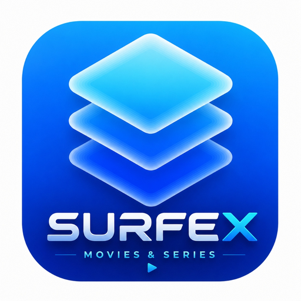
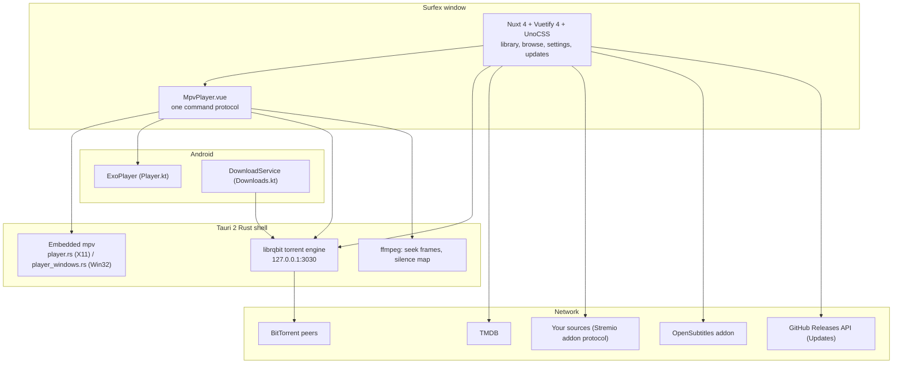

<div align="center">
<a name="readme-top"></a>



# Surfex

<h3>A modern Movies and Series media library and player for Desktop and Android TV</h3>

Keeps track of what you're watching, and plays movies and series in a real mpv window rather than a
browser `<video>` tag — so half-downloaded MKVs, HEVC, AV1 and DTS all just play. Built with
Nuxt 4 and Tauri 2, driven as happily by a TV remote as by a mouse.

<br/>

[![Version][badge-version]][releases] &nbsp;
[![License][badge-license]][license] &nbsp;
[![Tauri][badge-tauri]][tauri] &nbsp;
[![Nuxt][badge-nuxt]][nuxt] &nbsp;
[![Engine][badge-engine]][librqbit] &nbsp;
[![Platforms][badge-platforms]][releases]

<br/>

[Why Surfex](#why-surfex) &middot; [Features](#feature-tour) &middot; [Sources](#sources) &middot;
[In-App Updates](#in-app-updater) &middot; [Install](#install) &middot; [Build](#build-from-source) &middot; [Architecture](#architecture) &middot;
[FAQ](#faq) &middot; [Contributing](#contributing)

</div>

<br/>

> [!IMPORTANT]
> **Surfex hosts no content and indexes no content.** It ships with **no sources**, searches
> nothing on its own, and will not suggest anywhere to look. A source is a URL *you* add — see
> [Sources](#sources). With none configured, Surfex is a general-purpose torrent client with a
> very good player attached.

<br/>

<details>
<summary><kbd>Table of contents</kbd></summary>

<br/>

- [Why Surfex](#why-surfex)
- [Feature Tour](#feature-tour)
  - [Rooms and views](#rooms-and-views)
  - [The player](#the-player)
  - [Playback and codecs](#playback-and-codecs)
  - [Downloads](#downloads)
  - [Subtitles](#subtitles)
  - [Themes and appearance](#themes-and-appearance)
  - [Built for a remote](#built-for-a-remote)
- [In-App Updater](#in-app-updater)
- [Sources](#sources)
  - [Adding a source by link](#adding-a-source-by-link)
- [Your library](#your-library)
- [Privacy](#privacy)
- [Install](#install)
  - [Opening it on macOS](#opening-it-on-macos)
- [Configuration](#configuration)
- [Build from source](#build-from-source)
- [Architecture](#architecture)
- [Tests](#tests)
- [FAQ](#faq)
- [Contributing](#contributing)
- [Legal](#legal)
- [Acknowledgements](#acknowledgements)
- [License](#license)

</details>

<br/>

## Why Surfex

Most torrent-backed players are a browser `<video>` tag in a trench coat, and the codec support
shows. Surfex embeds the real thing and keeps the library around it honest and local.

- **A real mpv window, not a video tag.** On Linux and Windows the Rust side parents an actual
  mpv window into the page and keeps it glued to a box in the layout. mpv carries its own
  ffmpeg, so HEVC, AV1, 10-bit, E-AC-3, DTS and half-downloaded MKVs play with no codec packs.
- **The engine is in the app.** [librqbit][librqbit] runs in-process — a full downloads UI with
  file pickers, seeding, speed limits and a disk budget, not a hidden cache.
- **Streaming while it downloads.** Playback starts on the first bytes; already-downloaded
  titles replay with no TMDB lookup, no source search and no peers.
- **One player, three backends.** Where mpv can't be embedded, ExoPlayer (Android) or the
  webview's `<video>` answers the *same* command protocol, so there is one player component and
  one set of controls rather than three.
- **Dedicated In-App Updates System.** Built-in update manager with animated live progress tracking,
  platform-aware routing (Android APK auto-install, Windows, macOS, Linux).
- **Your library stays yours.** History, progress, favourites and the watchlist live in this
  device's storage. No Surfex account, no Surfex server, no sync — one file carries the lot.
- **Usable from the sofa.** Full d-pad navigation, focus-first styling and an Android TV build —
  a remote reaches everything a mouse does.
- **No sources, ever.** The empty source list is a deliberate feature, not an oversight.

<p align="right"><a href="#readme-top">&#9650; back to top</a></p>

## Feature Tour

<table>
<tr>
<td width="33%" valign="top">

**Browse and track**

Home, Movies, TV, Anime, Search, plus Favourites, Watchlist and History. TMDB metadata
throughout — posters, backdrops, cast, ratings, per-episode watched state and resume points.

</td>
<td width="33%" valign="top">

**Play anything**

Embedded mpv on the desktop, ExoPlayer on Android, `<video>` everywhere else. Subtitle search
with audio auto-sync, seek-preview thumbnails, audio and subtitle track menus, speed control.

</td>
<td width="33%" valign="top">

**Own the pipes**

An in-process BitTorrent engine with a real downloads page: magnets, `.torrent` files, file
selection, seeding, speed limits, a disk budget that evicts oldest-watched first, and a
Wi-Fi-only switch.

</td>
</tr>
</table>

<br/>

### Rooms and views

| Room | What you get |
| --- | --- |
| **Home** | Continue watching, Trending today, Popular movies and shows, Top rated, In cinemas |
| **Movies** / **TV** / **Anime** | Browse rows with grid or list layout, remembered per session |
| **Search** | One box across TMDB; results carry straight through to a source search |
| **Favourites** / **Watchlist** / **History** | The three local lists |
| **Detail** | Backdrop, synopsis, cast, trailer, seasons and episodes with per-episode state |
| **Downloads** | The engine's UI — add, pick files, pause, seed, limit, evict |
| **Settings** | Appearance, Sources, Subtitles, Audio, Network, Storage, Account, Updates, About |

<p align="right"><a href="#readme-top">&#9650; back to top</a></p>

### The player

One component, one set of controls, three backends underneath.

| Capability | Detail |
| --- | --- |
| **Backends** | Embedded mpv (Linux, Windows, macOS), ExoPlayer (Android), webview `<video>` (browser) — all answering the same command/property protocol |
| **Start early** | Playback begins on the first bytes; the engine is polled for a real byte before mpv launches, so a fresh torrent never opens a black box |
| **Seek preview** | Frames pulled with ffmpeg and cached, warmed only while the control bar is up |
| **Tracks** | The file's own audio and subtitle tracks, the release's subtitle files, and OpenSubtitles — in one menu |
| **Subtitle styling** | Font, size, colour, outline, position, applied to mpv and to the page-drawn cues alike, previewing live from Settings |
| **Volume levelling** | Quiet dialogue up, loud scenes down, in four steps — plus a dialogue boost that raises the centre channel of a 5.1 mix and nothing else. Set a default under Settings, or change the film you're watching from the player's Audio panel, which remembers that title alone |
| **Auto-sync** | A file cut for another release is slid onto the audio's silence map (desktop only — it needs ffmpeg, which Windows bundles) |
| **Resume** | Progress recorded as it plays, per episode, and picked back up from the card or the detail page |
| **Casting** | Hand the film to another Surfex on the same network — it streams from the device that already has it, resuming where you were, so nothing is downloaded twice. Devices are found by sweeping the subnet; acting on a cast needs the pairing code the receiving device shows. LAN only, off until switched on under Settings → Network, and no account or server anywhere in it |
| **Fullscreen** | Held for as long as the player is mounted; Android goes landscape and immersive |

<p align="right"><a href="#readme-top">&#9650; back to top</a></p>

### Playback and codecs

| Platform | Backend | Notes |
| --- | --- | --- |
| Linux | mpv | Needs `mpv` and `ffmpeg` on PATH |
| Windows | mpv | Ships its own `mpv.exe` and `ffmpeg.exe` — nothing to install |
| Android phone / TV | ExoPlayer | The device's own decoders; landscape and immersive while playing |
| macOS | mpv | Ships its own libmpv, linked rather than launched |
| Browser | `<video>` | Webview fallback |

<p align="right"><a href="#readme-top">&#9650; back to top</a></p>

### Downloads

The engine runs inside the app process, giving you full control over bandwidth, seeding, and storage quotas.

- **Adding:** A magnet, a `.torrent` file, or a release picked from a source.
- **Files:** Pick what to fetch inside a torrent; season packs download the one episode.
- **Seeding:** Configurable upload and download limits.
- **Disk budget:** Oldest-watched evicted first when the cache limit is reached.
- **Wi-Fi only:** Pauses background torrents on a metered connection and restarts them on Wi-Fi.
- **Android Foreground Service:** Keeps download tasks alive while you multitask.

<p align="right"><a href="#readme-top">&#9650; back to top</a></p>

### Subtitles

- **Embedded subtitles** inside video containers are detected automatically.
- **Online search** queries OpenSubtitles and configured Stremio-protocol addons.
- **Audio auto-sync** aligns subtitles with the spoken dialogue track.
- **Full visual customization** with real-time preview (font, size, color, background, outline, offset).

<p align="right"><a href="#readme-top">&#9650; back to top</a></p>

### Themes and appearance

- **Color Extraction:** Dynamic Material Design 3 palettes generated from your custom color or poster artwork.
- **28 Built-in Presets:** Surfex Dark, Surfex Light, Midnight (OLED), Carbon, Monochrome, Nord, Tokyo Night, Mocha, Dracula, Rosé Pine, Gruvbox, and more.
- **Custom Backgrounds & CSS:** Blur, tint, and custom CSS injection supported.

<p align="right"><a href="#readme-top">&#9650; back to top</a></p>

## In-App Updater

Starting from **v0.1.0**, Surfex features a dedicated in-app update center located at `Settings -> Updates`:

- **Automated Detection:** Bound directly to [Surfex GitHub Releases](https://github.com/smartworldarafath/Surfex---Movies-and-Series/releases).
- **Pure CSS Shimmering Progress Bar:** Real-time visual progress animations with byte counters (`MB / MB`), percentage, and transfer speed (`MB/s`).
- **Platform-Aware Action Routing:**
  - **Android (`.apk`):** Automatically downloads `Surfex.apk` via Android DownloadManager and invokes the native package installer.
  - **Windows (`.msi` / `.exe`):** Direct update installation or one-click standalone installer download.
  - **macOS (`.dmg` / `.app`):** Direct bundle download and installer.
  - **Linux (`.AppImage` / `.deb`):** In-place binary self-update or package download.
- **Changelog Viewer:** Clean markdown release notes rendered directly in the app.

<p align="right"><a href="#readme-top">&#9650; back to top</a></p>

## Sources

Surfex can search for a title if you tell it where to look. **It does not come with anywhere to
look, and it will not suggest one.**

A **source** is a URL you add under *Settings → Sources*, pointing at a server that speaks the
[Stremio addon protocol][stremio-sdk]:

```
GET  {source}/stream/movie/{imdbId}.json
GET  {source}/stream/series/{imdbId}:{season}:{episode}.json
→    { "streams": [ { "infoHash": "…", "title": "…", "name": "…" }, … ] }
```

### Adding a source by link

Surfex registers the `surfex://` URL scheme:

```html
<a href="surfex://your-addon.example.com/manifest.json">Add to Surfex</a>
```

The app opens, shows the URL, and **asks before adding it** — a link can never change what Surfex searches without user confirmation.

<p align="right"><a href="#readme-top">&#9650; back to top</a></p>

## Your library

Watch history, progress, favourites, the watchlist and every preference live in this device's `localStorage`. There is no Surfex account and no Surfex server, and nothing is synced anywhere.

**Backup & Restore:** *Settings → Account → Save a backup* writes `surfex-backup.json` to your documents folder, allowing painless transfers across devices.

<p align="right"><a href="#readme-top">&#9650; back to top</a></p>

## Privacy

- **Zero analytics, telemetry, or tracking.**
- **No accounts or sign-ins.**
- **Credentials stay local to your device.**
- **Direct peer-to-peer / source communication only.**

<p align="right"><a href="#readme-top">&#9650; back to top</a></p>

## Install

Download the latest release from [GitHub Releases][releases].

| Platform | Artifact | Details |
| --- | --- | --- |
| **Android Phone / Android TV** | `Surfex.apk` / `Surfex_v0.1.0.apk` | Sideload directly or update via in-app updater |
| **Windows** | `Surfex_0.1.0_x64-setup.exe` / `.msi` | Built-in mpv & ffmpeg |
| **Linux** | `Surfex_0.1.0_amd64.AppImage` / `.deb` / `.rpm` | Self-updating AppImage & distro packages |
| **macOS** | `Surfex.app` / `Surfex_0.1.0_aarch64.dmg` | Native Apple Silicon build with bundled libmpv |

### Opening it on macOS

For unsigned builds on macOS, clear the quarantine attribute:

```bash
xattr -dr com.apple.quarantine /Applications/Surfex.app
```

<p align="right"><a href="#readme-top">&#9650; back to top</a></p>

## Build from source

**Prerequisites**
- [Bun](https://bun.sh)
- [Rust](https://rustup.rs/)
- [Tauri 2 Prerequisites](https://v2.tauri.app/start/prerequisites/)
- Android NDK / SDK (for Android builds)

```bash
# Install dependencies
bun install

# Run Desktop Dev
bun run tauri:dev

# Run Android Dev
bun run tauri:dev:android

# Build Release Artifacts
bun run build            # Current OS native bundles
bun run build:windows    # Windows .exe
bun run build:android    # Android APK
```

<p align="right"><a href="#readme-top">&#9650; back to top</a></p>

## Architecture



<p align="right"><a href="#readme-top">&#9650; back to top</a></p>

## License

[MIT][license] © smartworldarafath / Surfex contributors.

<!-- links -->
[releases]: https://github.com/smartworldarafath/Surfex---Movies-and-Series/releases
[license]: LICENSE
[tauri]: https://v2.tauri.app/
[nuxt]: https://nuxt.com/
[librqbit]: https://github.com/ikatson/rqbit
[mpv]: https://mpv.io/
[stremio-sdk]: https://github.com/Stremio/stremio-addon-sdk

<!-- badges -->
[badge-version]: https://img.shields.io/badge/version-v0.1.0-FF5555?style=for-the-badge&labelColor=1a1a1a
[badge-license]: https://img.shields.io/badge/license-MIT-FF5555?style=for-the-badge&labelColor=1a1a1a
[badge-tauri]: https://img.shields.io/badge/Tauri-2-24C8DB?style=for-the-badge&logo=tauri&logoColor=white&labelColor=1a1a1a
[badge-nuxt]: https://img.shields.io/badge/Nuxt-4-00DC82?style=for-the-badge&logo=nuxt&logoColor=white&labelColor=1a1a1a
[badge-engine]: https://img.shields.io/badge/engine-librqbit-DEA584?style=for-the-badge&logo=rust&logoColor=white&labelColor=1a1a1a
[badge-platforms]: https://img.shields.io/badge/Linux%20%C2%B7%20Windows%20%C2%B7%20macOS%20%C2%B7%20Android%20TV-8a8a8a?style=for-the-badge&labelColor=1a1a1a
